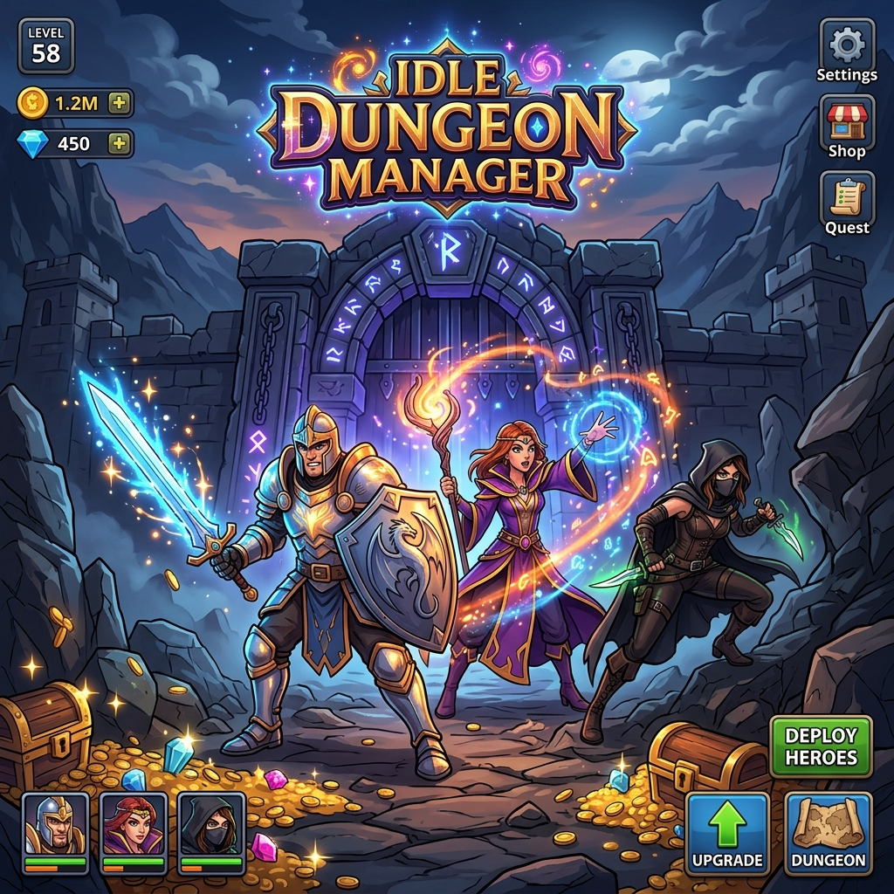

<div align="center">
  

  # 🏰 Idle Dungeon Manager

  **Manage your heroes, conquer dark dungeons, and amass legendary wealth!**

  [](https://angular.io/)
  [](https://tailwindcss.com/)
  [](LICENSE)

  [Features](#-key-features) • [Tech Stack](#-tech-stack) • [Installation](#-getting-started) • [Gameplay](#-gameplay)

</div>

---

## ✨ Key Features

*   **🛡️ Hero Management**: Recruit and level up unique heroes like **Alaric (Warrior)**, **Zephyr (Mage)**, and **Shadow (Rogue)**.
*   **⚔️ Dungeon Expeditions**: Deploy your heroes to dangerous locations such as the **Goblin Cave**, **Haunted Crypt**, and the legendary **Dragon Lair**.
*   **💰 Dynamic Economy**: Earn gold, gems, and essence to fund your empire.
*   **📈 Strategic Upgrades**: Invest in permanent upgrades like *Greedy Goblins* for more gold or *Swift Boots* for faster runs.
*   **🏆 Achievements**: Unlock rewards as you reach new milestones in your dungeon management career.
*   **💤 Offline Progress**: Your heroes continue to fight and earn gold even when you're away!

## 🛠️ Tech Stack

This project is built with modern, high-performance web technologies:

*   **Framework**: [Angular 21](https://angular.io/) (Signal-based reactivity)
*   **Styling**: [Tailwind CSS 4](https://tailwindcss.com/) & [DaisyUI](https://daisyui.com/)
*   **Icons**: [Lucide Angular](https://lucide.dev/)
*   **Persistence**: LocalStorage with state versioning
*   **Tooling**: Vite-powered build system

## 🚀 Getting Started

### Prerequisites

*   [Node.js](https://nodejs.org/) (v18 or higher)
*   npm (v9 or higher)

### Installation

1. Clone the repository:
   ```bash
   git clone https://github.com/MaikPeters1511/IdleDungeonManager.git
   ```

2. Install dependencies:
   ```bash
   npm install
   ```

3. Start the development server:
   ```bash
   npm start
   ```

4. Open your browser and navigate to `http://localhost:4200`

## 🎮 Gameplay

1.  **Unlock Heroes**: Start with Alaric and unlock more powerful heroes as you earn gold.
2.  **Assign Dungeons**: Select a hero and choose a dungeon that matches their power level.
3.  **Upgrade**: Use your earnings to level up heroes or buy global upgrades in the shop.
4.  **Complete Achievements**: Check the quest log for extra rewards.

---

<div align="center">
  <sub>Built with ❤️ by [MaikPeters1511](https://github.com/MaikPeters1511)</sub>
</div>
